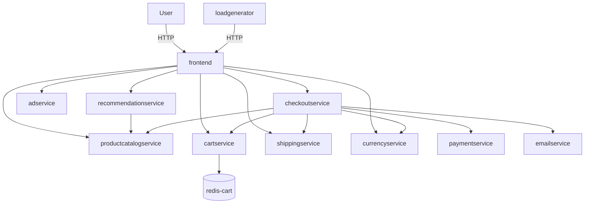

# 业务知识库（Agent 排障上下文）

> 目标：为值守/排障 Agent 提供稳定的业务上下文，而不是把所有知识塞进单条告警 Runbook。

## 1. 基础入口

### 1.1 Grafana

- Grafana 地址：`http://47.83.217.162:3000`
- APM 看板：`http://47.83.217.162:3000/d/fffrl21oam2gwa?from=now-6h&to=now`
- Dashboard UID：`fffrl21oam2gwa`
- 看板名称：`APM`

### 1.2 GitHub 仓库

- 仓库地址：`https://github.com/xianbintang/microservices-demo.git`

---

## 2. 服务依赖关系（根据当前截图整理）

> 说明：以下拓扑按你提供的依赖图录入，后续可继续修订。

## 3. 可用于止损的skills
- `mitigation-delete-target-pod`（删除单个目标 Pod）

## 4. 后续可补充的信息（预留）

- 关键业务链路（如下单链路）
- 每个服务的 owner / oncall 负责人
- 常见故障模式与对应止损动作
- 核心 SLO/SLA 阈值
- 变更入口（发布系统、配置中心）
- 常用排障命令与脚本索引
