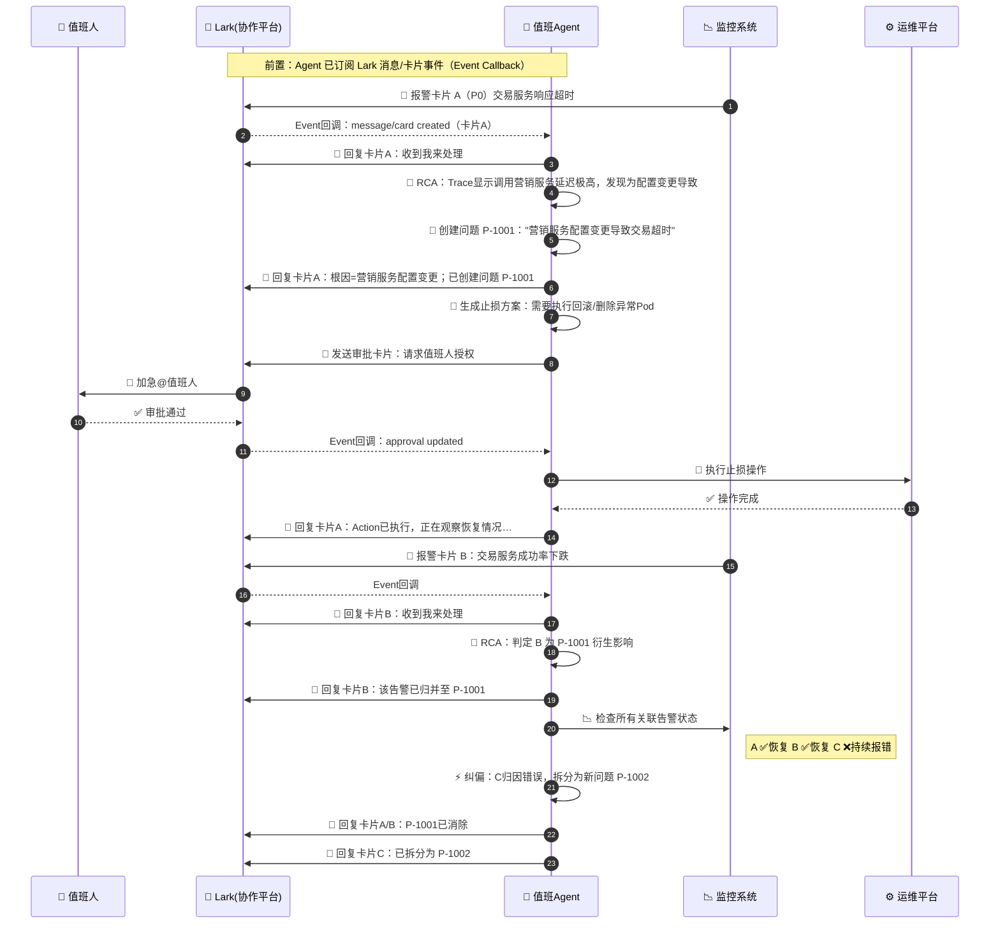

# 值班虚拟员工（OnCall Agent）技术方案

> 版本: v1.1 | 最后更新: 2026-03-31

---

## 1. 背景与目标

### 1.1 背景

当前基于 microservices-demo 项目搭建了完整的可观测性基础设施（Prometheus + Loki + Tempo + Grafana + OnCall），并实现了 alarm-service 作为告警中转服务，将 Grafana OnCall 的告警推送到飞书群，支持通过飞书卡片进行 ACK/Resolve/Silence 操作。

但目前 alarm-service 的所有回复逻辑都是**硬编码模板文案**，不具备智能分析和自动化处理能力，距离真正的"值班虚拟员工"仍有很大差距。

### 1.2 最终目标

构建一个 AI 驱动的值班虚拟员工，能够：

1. **自动接收告警** — 收到告警后主动回复"收到我来处理"
2. **RCA 根因分析** — 结合 Metrics/Traces/Logs/变更记录，自动定位根因
3. **问题管理** — 创建/跟踪/关闭问题（Problem），区别于 AlertGroup
4. **告警聚合归并** — 基于 RCA 将相关告警归并到同一问题下
5. **止损方案生成** — 根据 RCA 结果输出止损方案
6. **审批流** — 发飞书审批卡片，值班人授权后执行
7. **恢复验证** — 止损执行后自动检查告警是否恢复
8. **纠偏机制** — 发现归因错误时自动拆分，创建新问题
9. **人机协作** — 值班人可在任意阶段介入：纠正根因、修改方案、接管问题、静默告警
10. **智能对话** — 值班人 @Agent 提问，Agent 返回上下文感知的回答
11. **Problem 可视化** — 通过飞书群 Tab（H5 页面）查看问题全局视图和处理时间线

### 1.3 目标交互效果



---

## 2. 现状分析

### 2.1 已具备的能力

| 能力 | 实现 | 文件 |
|------|------|------|
| 飞书卡片发送 | Grafana OnCall → alarm-service → feishu_api.send_card() | `server.py` L330-414 |
| 飞书消息监听 | WebSocket 长连接 im.message.receive_v1 | `server.py` L592-617 |
| 卡片交互回调 | card.action.trigger → ACK/Resolve/Silence | `server.py` L454-545 |
| 审批卡片回调 | approval_confirm / approval_reject | `server.py` L479-489 |
| OnCall API 操作 | list/get/ack/resolve/silence/note | `oncall_api.py` |
| 飞书 API 封装 | 发送/回复/编辑卡片/加急/查历史/查成员 | `feishu_api.py` |
| 可观测性基础设施 | Prometheus + Loki + Tempo + Grafana + OnCall | `docker-compose.yml` |
| 业务知识库 | 服务拓扑、止损 skill 索引 | `business-knowledge.md` |
| SDK Bug 修复 | lark-oapi CARD 消息 monkey-patch | `server.py` L608-675 |

### 2.2 尚未实现的能力

| 缺失能力 | 对应时序图阶段 |
|----------|--------------|
| 🧠 RCA 根因分析引擎 | Agent 收到告警后自动分析 Trace/Metrics/Logs 定位根因 |
| 📝 问题（Problem）管理 | 创建/追踪/关闭问题（P-1001） |
| 🔗 告警聚合/归并 | 基于 RCA 将多条告警归并到同一问题下 |
| 🔧 Action 止损方案生成与执行 | 根据 RCA 结果自动输出止损方案并请求审批 |
| 🧾 审批流完整闭环 | 审批通过后触发 Agent 自动执行 |
| 📉 恢复验证（Check） | Action 执行后循环检查告警恢复状态 |
| ⚡ 纠偏机制 | 发现归因错误 → 拆分问题 → 创建新问题 |
| 💬 智能对话 | 值班人 @Agent 提问，Agent 返回上下文感知的回答 |

### 2.3 当前硬编码位置

| 位置 | 当前硬编码内容 | 改造目标 |
|------|---------------|---------|
| `server.py` L424-426 | "值班虚拟员工已收到告警，正在待命中" | 调用 Agent Core → RCA → 回复根因 |
| `server.py` L644-649 | "已记录，后续将自动分析并给出处置建议" | 调用 Agent Core → LLM 回答 |
| `server.py` L651-654 | "值班虚拟员工在线，如需处理告警请回复卡片" | 调用 Agent Core → 查 Problem 状态回答 |

---

## 3. 两阶段实施策略

### 3.1 总体策略

采用 **Demo → 生产** 两步走策略：

- **Phase 1 (Demo)**：用最轻量的方式快速跑通完整人机交互流程，1-2 天见效果
- **Phase 2 (生产)**：在 Demo 基础上升级为生产级 Agent，复用 70% 代码

```
Phase 1 (Demo)                          Phase 2 (生产)
━━━━━━━━━━━━━━━━                        ━━━━━━━━━━━━━━━━
原生 OpenAI API + Tool Calling           Claude Agent SDK + Router
轻量、快速、直观                         生产级编排、护栏、代码分析
alarm-service 内一体运行                 Agent 独立服务/容器
内存 + JSON 持久化                       同（或升级 SQLite）
完整飞书交互效果 ✅                       + 代码变更分析能力 ✅
```

### 3.2 代码复用矩阵

| 模块 | Phase 1 实现 | Phase 2 复用情况 |
|------|-------------|-----------------|
| `problem_manager.py` | 纯业务逻辑 | ✅ 100% 复用 |
| `grafana_query.py` | 查询函数 | ✅ 100% 复用（加 `@tool` 装饰器） |
| `action_engine.py` | 止损逻辑 | ✅ 100% 复用 |
| `server.py` 改造 | 事件接入 | ✅ 100% 复用 |
| `llm_client.py` | openai SDK | ⚠️ 替换为 Agent SDK |
| `agent_core.py` | 简单 loop | ⚠️ 替换为 Agent SDK 编排 |

---

## 4. Phase 1 技术架构（Demo）

### 4.1 架构总览

```
┌─────────────────────────────────────────────────────────────────┐
│                         外部系统                                │
│  ┌──────────┐  ┌──────────┐  ┌──────────┐  ┌───────────────┐   │
│  │ Grafana  │  │ Grafana  │  │   飞书   │  │  K8s 集群     │   │
│  │ Alerting │  │  OnCall  │  │  (Lark)  │  │ (PaaS 操作)   │   │
│  └────┬─────┘  └────┬─────┘  └────┬─────┘  └──────┬────────┘   │
└───────┼──────────────┼─────────────┼───────────────┼────────────┘
        │              │             │               │
        ▼              ▼             ▼               ▼
┌─────────────────────────────────────────────────────────────────┐
│                alarm-service（值班 Agent 服务）                  │
│                                                                 │
│  ┌───────────────────────────────────────────────────────┐      │
│  │                 入口层 (server.py)                     │      │
│  │  ┌───────────────┐    ┌──────────────────────────┐    │      │
│  │  │ HTTP Server   │    │ 飞书 WebSocket 长连接     │    │      │
│  │  │ POST /webhook │    │ card.action.trigger       │    │      │
│  │  │ GET /health   │    │ im.message.receive_v1    │    │      │
│  │  └───────┬───────┘    └────────────┬─────────────┘    │      │
│  └──────────┼─────────────────────────┼──────────────────┘      │
│             │                         │                          │
│             ▼                         ▼                          │
│  ┌──────────────────────────────────────────────────────┐       │
│  │           Agent Core (agent_core.py)                  │       │
│  │           —— 值班 Agent 的"大脑"                      │       │
│  │                                                       │       │
│  │  on_alert_received()    ← 告警到达                    │       │
│  │  on_message_received()  ← 人类消息 / @Agent           │       │
│  │  on_approval_callback() ← 审批按钮点击                │       │
│  │  _check_recovery()      ← 后台定时检查                │       │
│  └────┬──────────┬──────────┬──────────┬────────────────┘       │
│       │          │          │          │                         │
│       ▼          ▼          ▼          ▼                         │
│  ┌────────┐ ┌────────┐ ┌────────┐ ┌────────┐                   │
│  │Problem │ │  LLM   │ │ Action │ │Grafana │                   │
│  │Manager │ │ Client │ │ Engine │ │ Query  │                   │
│  │        │ │        │ │        │ │        │                   │
│  │问题CRUD│ │RCA分析 │ │止损方案│ │Prometh.│                   │
│  │状态机  │ │方案生成│ │执行引擎│ │Loki    │                   │
│  │归并拆分│ │对话回答│ │审批管理│ │Tempo   │                   │
│  │JSON存储│ │工具调用│ │K8s操作 │ │指标查询│                   │
│  └────────┘ └────────┘ └────────┘ └────────┘                   │
│       │          │          │          │                         │
│  ┌────┴──────────┴──────────┴──────────┴───────────────┐        │
│  │                   基础设施层                         │        │
│  │  feishu_api.py  oncall_api.py  business-knowledge   │        │
│  └─────────────────────────────────────────────────────┘        │
│  ┌─────────────────────────────────────────────────────┐        │
│  │  data/problems.json — Problem 持久化存储             │        │
│  └─────────────────────────────────────────────────────┘        │
└─────────────────────────────────────────────────────────────────┘
```

### 4.2 技术选型

| 维度 | 选择 | 理由 |
|------|------|------|
| LLM 调用 | `openai` Python SDK | 最轻量；通过 `OPENAI_BASE_URL` 兼容 OpenAI/Claude/DeepSeek/OpenRouter 等任意兼容 API |
| Agent 循环 | 自写 Tool Calling Loop (~100 行) | Demo 阶段够用，代码透明可调试 |
| Problem 存储 | 内存 dict + JSON 文件持久化 | 最简单，重启不丢数据 |
| 部署方式 | alarm-service 同容器 | 不增加基础设施复杂度 |
| 并发处理 | threading | 与现有 server.py 风格一致 |

### 4.3 文件结构

```
src/alarm-service/
├── server.py              # 改造：接入 agent_core
├── agent_core.py          # 新增：Agent 协调器
├── problem_manager.py     # 新增：Problem CRUD + 状态机
├── llm_client.py          # 新增：LLM 调用封装
├── grafana_query.py       # 新增：Grafana 数据查询
├── action_engine.py       # 新增：止损执行引擎
├── requirements.txt       # 改造：新增 openai 依赖
├── Dockerfile             # 现有
└── data/
    └── problems.json      # 新增：Problem 持久化
```

### 4.4 模块间依赖关系

```
server.py（入口层）
    │
    ├── agent_core.py（大脑，协调所有模块）
    │       │
    │       ├── problem_manager.py（读写 data/problems.json）
    │       │
    │       ├── llm_client.py（LLM 调用）
    │       │       │
    │       │       └── grafana_query.py（给 LLM 提供工具调用能力）
    │       │
    │       ├── action_engine.py（止损执行）
    │       │
    │       └── grafana_query.py（恢复验证时查询告警状态）
    │
    ├── feishu_api.py（飞书通信，现有）
    │
    └── oncall_api.py（OnCall 操作，现有）
```

---

## 5. 模块详细设计

### 5.1 Problem Manager (`problem_manager.py`)

#### 数据模型

```python
@dataclass
class ProblemEvent:
    """问题处理时间线事件，记录每一步操作用于可视化和审计。"""
    timestamp: float           # 事件时间戳
    event_type: str            # created | rca_completed | alert_merged | approval_sent
                               # | approved | rejected | action_executed | recovery_check
                               # | resolved | corrected | takeover | silenced
                               # | reanalyze | info_supplemented | root_cause_updated
    description: str           # "RCA 分析完成：根因为营销服务配置变更"
    operator: str              # "agent" | 审批人 open_id / 姓名

@dataclass
class Action:
    id: str                    # "ACT-001"
    description: str           # "删除 adservice 异常 Pod"
    status: str                # pending | approved | executing | completed | failed | rejected
    approved_by: str           # 审批人 open_id
    executed_at: float         # 执行时间戳
    result: str                # 执行结果描述

@dataclass
class Problem:
    id: str                    # "P-1001"
    title: str                 # "营销服务配置变更导致交易超时"
    status: str                # open | pending | recovering | resolved | takeover | silenced
    root_cause: str            # "营销服务配置变更导致交易延迟"
    alert_group_ids: list[str] # ["AGID001", "AGID002"]
    message_ids: dict          # {"AGID001": "msg_xxx"} 告警→飞书消息映射
    actions: list[Action]      # 止损动作列表
    events: list[ProblemEvent] # 处理时间线（用于 H5 页面展示和审计追踪）
    created_at: float
    resolved_at: float | None
    silenced_until: float | None  # 静默截止时间（仅 silenced 状态下有值）
    taken_over_by: str | None     # 接管人（仅 takeover 状态下有值）
    linked_issues: list[str]      # 关联的外部 Issue 链接（JIRA/GitLab 等）
```

> **状态说明**
>
> | 状态 | 含义 |
> |------|------|
> | `open` | 刚收到告警，Agent 正在分析或尚未生成止损方案 |
> | `pending` | Agent 已完成 RCA 并生成止损方案，等待值班人审批执行 |
> | `recovering` | 止损方案已批准并在执行/已执行，等待告警恢复 |
> | `resolved` | 所有关联告警已恢复，问题关闭 |
> | `takeover` | 值班人已接管，Agent 暂停自动操作 |
> | `silenced` | 已知问题或误报，已静默一段时间不再提醒 |

#### 状态机

```
                  create_problem()
                       │
                       ▼
                   ┌───────┐
            ┌──────│ open  │──────────────────────────┐
            │      └───┬───┘                          │
            │          │                              │
            │    RCA完成 + 生成止损方案                  │
            │          │                              │
            │          ▼                              │
            │    ┌──────────┐     用户说               │
            │    │ pending  │─────"我来处理"────┐       │
            │    │ (待执行) │                  │       │
            │    └────┬─────┘                  │       │
            │         │                        │       │
            │  approve_action()                │       │
            │   + execute                      │       │
            │         │                        ▼       │
            │         │                 ┌──────────┐   │
    用户说    │         │                 │ takeover │   │
  "静默7天"  │         │                 │ (人工中) │   │
            │         ▼                 └─────┬────┘   │
            │   ┌───────────┐                 │        │
            │   │recovering │◄────────────────┘        │
            │   └─────┬─────┘  人工处理完成              │
            │         │       → 标记恢复中              │
            ▼    ┌────┼────────┐                       │
     ┌──────────┐│    │        │                       │
     │ silenced ││    ▼        ▼                       │
     │(已静默)  ││ 全部恢复  部分未恢复                   │
     └──────────┘│    │        │                       │
                 │    ▼        ▼                       │
                 │┌────────┐  纠偏拆分                  │
                 ││resolved│  → 未恢复的回到 open ───────┘
                 │└────────┘
                 │
                 └─ 人工处理完成 → resolved
```

> **状态转换触发条件一览**
>
> | 源状态 | 目标状态 | 触发条件 |
> |--------|----------|---------|
> | `open` | `pending` | Agent 完成 RCA 并生成止损方案 |
> | `open` | `takeover` | 值班人在飞书群说"我来处理" / 点击卡片"接管"按钮 |
> | `open` | `silenced` | 值班人说"静默 X 天" / 点击卡片"静默"按钮 |
> | `pending` | `recovering` | 值班人批准止损方案并开始执行 |
> | `pending` | `takeover` | 值班人拒绝方案后选择接管 |
> | `pending` | `open` | 值班人拒绝方案，要求重新分析（带新线索） |
> | `recovering` | `resolved` | 所有关联告警恢复 |
> | `recovering` | `open`（新 Problem） | 纠偏拆分：部分告警未恢复，创建新问题 |
> | `takeover` | `recovering` | 人工执行操作后标记为恢复中 |
> | `takeover` | `resolved` | 人工直接关闭问题 |
> | `silenced` | `open` | 静默到期，告警仍在触发 |
> | `silenced` | `resolved` | 静默期间告警自行恢复 |

#### 核心接口

| 方法 | 说明 |
|------|------|
| `create_problem(title, root_cause, alert_group_id, message_id) -> Problem` | 创建新问题，自动分配 P-XXXX ID |
| `merge_alert(problem_id, alert_group_id, message_id)` | 将告警归并到已有问题 |
| `detach_alert(problem_id, alert_group_id) -> Problem` | 纠偏拆分：从问题中移除告警，创建新问题 |
| `update_status(problem_id, status)` | 状态流转 |
| `add_action(problem_id, action)` | 添加止损动作 |
| `add_event(problem_id, event)` | 添加时间线事件（每次操作都应记录） |
| `update_root_cause(problem_id, new_root_cause, operator)` | 纠偏：修改根因描述 |
| `takeover_problem(problem_id, operator)` | 人工接管问题，Agent 暂停自动操作 |
| `silence_problem(problem_id, duration, operator)` | 静默问题及其关联告警 |
| `link_issue(problem_id, issue_url)` | 关联外部 Issue（JIRA/GitLab） |
| `get_open_problems() -> list[Problem]` | 获取所有未解决的问题 |
| `get_problem(problem_id) -> Problem` | 获取指定问题 |
| `find_related_problem(alert_info) -> Problem or None` | 查找可归并的问题（时间窗口+服务关联） |

#### 持久化

- 内存中维护 `dict[str, Problem]`
- 每次写操作后自动序列化到 `data/problems.json`
- 服务启动时从 JSON 文件恢复

### 5.2 LLM Client (`llm_client.py`)

#### 概述

封装 LLM 调用，对外提供三个高层函数。内部实现 Tool Calling 循环，让 LLM 可以多轮调用工具获取信息后再给出最终答案。

#### 配置

通过环境变量配置，兼容任意 OpenAI 格式的 API：

```
OPENAI_API_KEY=sk-xxx
OPENAI_BASE_URL=https://api.openai.com/v1    # 或 DeepSeek/OpenRouter 等
OPENAI_MODEL=gpt-4o                           # 默认模型
```

#### 核心接口

| 方法 | 输入 | 输出 | 说明 |
|------|------|------|------|
| `analyze_alert(alert_info, open_problems)` | 告警详情 + 当前活跃问题列表 | `RCAResult(root_cause, is_new, related_problem_id, action_plan)` | RCA 根因分析 |
| `generate_action_plan(problem)` | Problem 详情 | `ActionPlan(description, action_type, target)` | 生成止损方案 |
| `answer_question(question, context)` | 用户问题 + 上下文 | `str` (自然语言回答) | 回答值班人提问 |

#### Tool Calling 工具定义

LLM 在分析过程中可调用以下工具获取数据：

| 工具名 | 说明 | 数据来源 |
|--------|------|---------|
| `query_prometheus` | 查询 Prometheus 指标（错误率、延迟、CPU 等） | Grafana API |
| `query_loki_logs` | 查询 Loki 日志（错误日志模式） | Grafana API |
| `query_tempo_traces` | 查询 Tempo 链路追踪（慢请求） | Grafana API |
| `get_open_problems` | 获取当前活跃问题列表 | Problem Manager |
| `get_service_dependencies` | 获取服务依赖拓扑 | business-knowledge.md |
| `check_alert_group_status` | 检查 OnCall AlertGroup 状态 | OnCall API |
| `update_root_cause` | 纠偏：修改问题根因描述 | Problem Manager |
| `reanalyze_problem` | 纠偏：根据用户提供的新线索重新做 RCA | Agent Core + LLM |
| `silence_problem` | 静默问题及其关联告警一段时间 | Problem Manager + OnCall API |
| `takeover_problem` | 人工接管问题，Agent 暂停自动操作 | Problem Manager |
| `update_action_plan` | 纠偏：修改/替换当前止损方案 | Problem Manager |
| `link_issue` | 关联外部 Issue（JIRA/GitLab URL） | Problem Manager |
| `close_problem` | 手动关闭问题（标记为误报/已知问题/无需处理） | Problem Manager |

#### System Prompt 结构

```
你是一个值班虚拟员工（OnCall Agent），负责处理线上告警。

## 你的职责
1. 收到告警后，分析根因（RCA）
2. 判断是否是新问题，还是已有问题的衍生影响
3. 如果是新问题，创建 Problem 并给出止损方案
4. 如果是已有问题的衍生，归并到已有 Problem

## 业务知识
{business_knowledge_content}

## 当前活跃问题
{open_problems_summary}

## 输出格式
请以 JSON 格式输出分析结果：
{
  "root_cause": "根因描述",
  "is_new_problem": true/false,
  "related_problem_id": "P-1001 或 null",
  "confidence": 0.0-1.0,
  "action_plan": "建议的止损方案（如果有的话）",
  "reasoning": "推理过程简述"
}
```

#### Tool Calling 循环（伪代码）

```python
def _run_tool_calling_loop(messages, tools, max_rounds=10):
    for _ in range(max_rounds):
        response = openai.chat.completions.create(
            model=MODEL, messages=messages, tools=tools
        )
        choice = response.choices[0]

        if choice.finish_reason == "stop":
            return choice.message.content

        if choice.finish_reason == "tool_calls":
            messages.append(choice.message)
            for tool_call in choice.message.tool_calls:
                result = _execute_tool(tool_call)
                messages.append({
                    "role": "tool",
                    "tool_call_id": tool_call.id,
                    "content": json.dumps(result)
                })
    raise TimeoutError("Tool calling 超过最大轮次")
```

### 5.3 Grafana Query (`grafana_query.py`)

#### 概述

封装 Grafana 数据源查询，为 LLM 的 Tool Calling 和恢复验证提供数据。

#### 核心接口

| 方法 | 说明 |
|------|------|
| `query_prometheus(expr, time_range)` | 执行 PromQL 查询 |
| `query_loki(query, time_range, limit)` | 执行 LogQL 查询 |
| `query_tempo_traces(service, operation, min_duration)` | 查询慢链路 |
| `check_alert_rules_status()` | 检查告警规则当前状态（firing/normal） |
| `get_service_metrics_summary(service_name)` | 获取服务核心指标摘要（错误率、延迟、CPU） |

#### 实现方式

通过 Grafana HTTP API（`/api/ds/query` 或 `/api/datasources/proxy/`），使用 Basic Auth 认证。

### 5.4 Action Engine (`action_engine.py`)

#### 概述

管理止损方案的生成、审批和执行。

#### 核心接口

| 方法 | 说明 |
|------|------|
| `create_action(problem_id, description, action_type, target)` | 创建止损动作（状态=pending） |
| `send_approval_card(action, problem)` | 构建并发送飞书审批卡片 |
| `execute_action(action)` | 执行止损操作（目前支持 delete-pod） |
| `handle_approval(action_id, approved, operator)` | 处理审批回调 |

#### 审批卡片设计

```json
{
  "header": {"template": "orange", "title": "🧾 止损审批 - P-1001"},
  "elements": [
    {"tag": "markdown", "content": "**问题**: 营销服务配置变更导致交易超时"},
    {"tag": "markdown", "content": "**根因**: adservice 配置变更导致交易链路延迟"},
    {"tag": "markdown", "content": "**方案**: 删除 adservice 异常 Pod 触发重建"},
    {"tag": "action", "actions": [
      {"text": "✅ 同意执行", "behaviors": [{"type": "callback", "value": {"action": "approval_confirm", "approval_id": "ACT-001"}}]},
      {"text": "❌ 拒绝", "behaviors": [{"type": "callback", "value": {"action": "approval_reject", "approval_id": "ACT-001"}}]}
    ]}
  ]
}
```

### 5.5 Agent Core (`agent_core.py`)

#### 概述

值班 Agent 的大脑，协调所有模块。不直接调用外部 API，通过各模块完成具体工作。

#### 核心流程

##### 5.5.1 告警到达处理

```python
async def on_alert_received(alert_info, message_id, alert_group_id):
    """
    告警到达时的完整处理流程。
    由 server.py 的 handle_grafana_webhook 在发送飞书卡片后调用。
    """
    # 1. 立即回复"收到我来处理"
    feishu_api.reply_in_thread(message_id, "🤖 收到告警，正在分析根因...")

    # 2. 获取当前活跃问题列表
    open_problems = problem_manager.get_open_problems()

    # 3. 调用 LLM 做 RCA 分析
    rca_result = llm_client.analyze_alert(alert_info, open_problems)

    # 4. 根据 RCA 结果决策
    if rca_result.is_new_problem:
        # 4a. 创建新问题
        problem = problem_manager.create_problem(
            title=rca_result.root_cause,
            root_cause=rca_result.root_cause,
            alert_group_id=alert_group_id,
            message_id=message_id,
        )
        feishu_api.reply_in_thread(message_id,
            f"🧠 RCA 分析结果:\n根因: {rca_result.root_cause}\n已创建问题 {problem.id}")

        # 4b. 如果有止损方案，发审批卡片
        if rca_result.action_plan:
            action = action_engine.create_action(problem.id, rca_result.action_plan)
            action_engine.send_approval_card(action, problem)
    else:
        # 4c. 归并到已有问题
        problem_manager.merge_alert(rca_result.related_problem_id, alert_group_id, message_id)
        feishu_api.reply_in_thread(message_id,
            f"🔗 该告警为问题 {rca_result.related_problem_id} 的衍生影响，已归并统一处理。")
```

##### 5.5.2 审批回调处理

```python
async def on_approval_callback(approval_id, approved, operator_id):
    """审批按钮点击后的处理。"""
    action = action_engine.handle_approval(approval_id, approved, operator_id)

    if approved:
        # 执行止损
        problem_manager.update_status(action.problem_id, "recovering")
        result = action_engine.execute_action(action)

        # 回复飞书
        problem = problem_manager.get_problem(action.problem_id)
        for msg_id in problem.message_ids.values():
            feishu_api.reply_in_thread(msg_id,
                f"✅ Action 已执行成功，正在观察恢复情况...")

        # 启动恢复验证
        threading.Thread(target=_check_recovery_loop, args=(action.problem_id,)).start()
```

##### 5.5.3 恢复验证循环

```python
def _check_recovery_loop(problem_id, interval=30, max_checks=20):
    """后台线程：定期检查关联告警是否恢复。"""
    problem = problem_manager.get_problem(problem_id)

    for i in range(max_checks):
        time.sleep(interval)
        statuses = {}
        for ag_id in problem.alert_group_ids:
            status = grafana_query.check_alert_group_status(ag_id)
            statuses[ag_id] = status

        recovered = [id for id, s in statuses.items() if s == "resolved"]
        not_recovered = [id for id, s in statuses.items() if s != "resolved"]

        if not not_recovered:
            # 全部恢复 → 问题消除
            problem_manager.update_status(problem_id, "resolved")
            for msg_id in problem.message_ids.values():
                feishu_api.reply_in_thread(msg_id, f"🎉 {problem_id} 已消除，所有告警已恢复！")
            return

    # 部分未恢复 → 触发纠偏
    if recovered and not_recovered:
        _do_correction(problem_id, recovered, not_recovered)
```

##### 5.5.4 纠偏拆分

```python
def _do_correction(problem_id, recovered_ids, not_recovered_ids):
    """纠偏：将未恢复的告警从当前问题拆出，创建新问题。"""
    problem = problem_manager.get_problem(problem_id)

    # 关闭当前问题（已恢复部分）
    problem_manager.update_status(problem_id, "resolved")
    for ag_id in recovered_ids:
        msg_id = problem.message_ids.get(ag_id)
        if msg_id:
            feishu_api.reply_in_thread(msg_id, f"🎉 {problem_id} 已消除，该告警已恢复！")

    # 拆出未恢复的告警 → 创建新问题
    for ag_id in not_recovered_ids:
        new_problem = problem_manager.detach_alert(problem_id, ag_id)
        msg_id = problem.message_ids.get(ag_id)
        if msg_id:
            feishu_api.reply_in_thread(msg_id,
                f"⚡ 纠偏：该告警与 {problem_id} 无关，已拆分为新问题 {new_problem.id}。")

        # 对新问题重新走 RCA 流程
        on_alert_received(...)  # 重新分析
```

##### 5.5.5 人类 @Agent 对话（含纠偏意图识别）

```python
async def on_message_received(text, message_id, chat_id, alert_context=None):
    """
    值班人 @Agent 或在告警话题中说话时的处理。
    
    除了回答问题外，LLM 还会识别用户的"纠偏意图"并调用相应工具：
    - 重新分析类："根因不对，查一下 cartservice 最近有没有发版"
    - 人工提供信息类："这是已知 bug，关联 JIRA #ISSUE-123"
    - 静默/挂起类："不用管了，静默 7 天"
    - 接管类："我来处理这个问题"
    - 修改方案类："不要删 Pod，改成重启 cartservice"
    - 关闭/误报类："误报，关掉"
    - 提问类（已有）："当前有哪些未恢复的问题？"
    """
    open_problems = problem_manager.get_open_problems()
    context = {
        "open_problems": open_problems,
        "alert_context": alert_context,
    }
    
    # LLM 拥有以下工具，能自主决策调用哪些：
    # - 数据查询工具：query_prometheus, query_loki_logs, query_tempo_traces, ...
    # - 纠偏工具：update_root_cause, reanalyze_problem, silence_problem,
    #             takeover_problem, update_action_plan, link_issue, close_problem
    # - 回答工具：（无需工具，直接生成自然语言回复）
    #
    # LLM 通过 System Prompt 理解用户意图，自动选择调用哪些工具。
    # 例如用户说"这是已知 bug #ISSUE-123，静默一周"，LLM 会：
    #   1. 调用 link_issue(problem_id, "https://jira.xxx/ISSUE-123")
    #   2. 调用 silence_problem(problem_id, "7d")
    #   3. 生成回复："已关联 ISSUE-123 并静默 7 天。"
    
    answer = llm_client.answer_question(text, context)
    feishu_api.reply_in_thread(message_id, answer)
```

---

## 6. 人机协作与纠偏机制

> Agent 不可能每次都对。线上问题千变万化，RCA 分析错误、止损方案不合适是常态而非例外。因此，**让值班人能在任意阶段介入、纠偏、甚至接管**，是这个系统能否真正落地的关键。

### 6.1 三层协作架构

```
┌─────────────────────────────────────────────────────────────┐
│                   人机协作三层机制                            │
│                                                             │
│  第一层：飞书群内对话纠偏（最自然、最高频）                      │
│  ┌─────────────────────────────────────────────────────┐    │
│  │  值班人直接在告警话题下 @Agent 说话：                  │    │
│  │  "根因不对，这是已知的 bug，#ISSUE-123"              │    │
│  │  "不用止损了，静默 7 天"                              │    │
│  │  "查一下 cartservice 的日志，别看 adservice"          │    │
│  │  "我来接管这个问题"                                   │    │
│  │                                                     │    │
│  │  Agent 收到后：识别意图 → 调用工具 → 更新 Problem     │    │
│  └─────────────────────────────────────────────────────┘    │
│                                                             │
│  第二层：飞书卡片快捷操作（结构化、一键触发）                    │
│  ┌─────────────────────────────────────────────────────┐    │
│  │  在告警卡片/审批卡片上增加操作按钮：                    │    │
│  │  [👤 接管]  [🔇 静默]  [🔄 重新分析]  [💬 补充信息]   │    │
│  └─────────────────────────────────────────────────────┘    │
│                                                             │
│  第三层：H5 问题管理页面（全局视角、重操作）                    │
│  ┌─────────────────────────────────────────────────────┐    │
│  │  通过飞书群 Tab 打开 H5 页面：                        │    │
│  │  - 问题列表：全局视图，按状态筛选                      │    │
│  │  - 问题详情：根因/关联告警/止损动作/时间线              │    │
│  │  - 管理操作：编辑根因/关联 Issue/手动添加动作           │    │
│  └─────────────────────────────────────────────────────┘    │
└─────────────────────────────────────────────────────────────┘
```

**为什么分三层：**

- **第一层（飞书对话）是主战场** — 值班人处理告警时本身就在飞书群里，直接 @Agent 说话是最自然的方式。LLM 天然能理解自然语言意图，不需要用户学习任何命令格式。
- **第二层（卡片按钮）覆盖高频标准操作** — "接管"、"静默"、"重新分析"太常见了，不该每次都打字。
- **第三层（H5 页面）做管理兜底** — 当用户需要看全局、做更精细的操作时使用。

### 6.2 第一层：飞书群内对话纠偏

这是最重要的一层。Agent 的 `on_message_received` 方法（5.5.5 节）已支持通过 LLM Tool Calling 识别用户意图并执行相应动作。

#### 需要识别的纠偏意图

| 意图类型 | 用户消息示例 | Agent 调用的工具 |
|----------|------------|----------------|
| 🔄 重新分析 | "根因不对，查一下 cartservice 最近有没有发版" | `reanalyze_problem(hint="检查 cartservice 发版记录")` |
| 🔄 重新分析 | "不是配置问题，看看是不是 DB 连接池满了" | `reanalyze_problem(hint="检查 DB 连接池指标")` |
| 📝 提供信息 | "这是已知 bug，关联 JIRA #ISSUE-123" | `link_issue(url)` + `update_root_cause(...)` |
| 📝 提供信息 | "正确的根因是：Redis sentinel 配置了错误的 quorum 值" | `update_root_cause(new_cause=...)` |
| 🔇 静默 | "不用管了，静默 7 天" | `silence_problem(duration="7d")` |
| 🔇 静默 | "静默到下周一" | `silence_problem(duration=...)` |
| 👤 接管 | "我来处理这个问题" | `takeover_problem(operator=...)` |
| 👤 接管 | "先不要自动操作，我手动处理" | `takeover_problem(operator=...)` |
| 🔧 修改方案 | "不要删 Pod，改成重启 cartservice" | `update_action_plan(new_actions=...)` |
| 🔧 修改方案 | "加一个操作：扩容 HPA 到 10 副本" | `update_action_plan(append_action=...)` |
| ❌ 关闭/误报 | "误报，关掉" | `close_problem(reason="误报")` |
| ❓ 提问 | "当前 P-1001 的状态是什么？" | 直接回复（无需工具） |

#### 实现原理

不需要硬编码意图分类——LLM 通过 System Prompt 中的工具描述和指引，自然理解用户消息的意图并选择合适的工具调用。例如用户说"这是已知 bug #ISSUE-123，静默一周"，LLM 会自行决定：

1. 调用 `link_issue(problem_id, "https://jira.xxx/ISSUE-123")`
2. 调用 `silence_problem(problem_id, "7d")`
3. 生成回复："已关联 ISSUE-123 并静默 7 天。"

### 6.3 第二层：飞书卡片快捷操作

在 Agent 回复的 RCA 结果卡片上，增加结构化操作按钮：

```
┌─────────────────────────────────────────────┐
│  🧠 RCA 分析结果                              │
│                                             │
│  问题: P-1003                               │
│  根因: payment-gateway TLS 证书过期           │
│  置信度: ⭐⭐⭐⭐ (85%)                       │
│                                             │
│  止损方案:                                   │
│  1. 更新 TLS 证书                            │
│  2. 重启 payment-gateway Pod                 │
│                                             │
│  ┌──────┐  ┌──────┐  ┌────────┐  ┌──────┐  │
│  │✅ 执行│  │🔄 重分析│  │🔇 静默 │  │👤 接管│  │
│  └──────┘  └──────┘  └────────┘  └──────┘  │
│                                             │
│  ┌──────────┐  ┌───────────┐               │
│  │💬 补充信息│  │❌ 标记误报 │               │
│  └──────────┘  └───────────┘               │
└─────────────────────────────────────────────┘
```

| 按钮 | 回调动作 | 效果 |
|------|---------|------|
| ✅ 执行 | `approval_confirm` | 批准止损方案，开始执行（现有功能） |
| 🔄 重新分析 | `reanalyze` | 弹出输入框（飞书 form_action），用户输入分析方向后 Agent 重新 RCA |
| 🔇 静默 | `silence` | 弹出时长选择（1h/6h/1d/7d），静默该问题下所有告警 |
| 👤 接管 | `takeover` | Agent 停止自动操作，问题标记为"人工处理中" |
| 💬 补充信息 | `supplement` | 弹出输入框，用户提供额外上下文（已知 bug 编号、正确根因等） |
| ❌ 标记误报 | `close_false_alarm` | 关闭问题，标记为误报 |

> 注："🔄 重新分析"和"💬 补充信息"按钮需要飞书卡片支持 `form_action`（弹出输入框），这是飞书开放平台已支持的能力。

### 6.4 第三层：H5 问题管理页面

通过飞书群 Tab（群标签页）承载 H5 页面，提供全局视角的问题管理能力。

#### 页面结构

```
┌───────────────────────────────────────┐
│     alarm-service HTTP Server         │
│     GET /problems                     │
│     (serve 静态 H5 + API)             │
└──────────────┬────────────────────────┘
               │
               ▼
┌───────────────────────────────────────┐
│     H5 前端页面（轻量 SPA）            │
│                                       │
│  📋 问题列表页                         │
│  ├─ 顶部统计栏：各状态问题数量          │
│  ├─ 状态筛选：全部/未解决/待执行/...    │
│  └─ 问题卡片列表（点击进入详情）        │
│                                       │
│  📄 问题详情页                         │
│  ├─ 基本信息：编号/状态/标题/时间       │
│  ├─ 🧠 根因分析                       │
│  ├─ 🚨 关联告警                       │
│  ├─ ⏳ 待执行动作（可审批操作）         │
│  ├─ 🔧 已完成动作                     │
│  └─ 📋 处理时间线                     │
└───────────────────────────────────────┘
```

#### 后端 API

在 alarm-service 的 HTTP Server 中增加以下端点：

| 端点 | 说明 |
|------|------|
| `GET /api/problems` | 获取问题列表（支持 status 筛选） |
| `GET /api/problems/:id` | 获取问题详情（含 events 时间线） |
| `POST /api/problems/:id/actions/:actionId/approve` | 审批：批准止损动作 |
| `POST /api/problems/:id/actions/:actionId/reject` | 审批：取消止损动作 |
| `GET /static/problem.html` | H5 页面静态资源 |

#### 飞书群 Tab 配置

通过飞书开放平台 API 将 H5 页面添加为群标签页：

```python
# 添加群 Tab 的 API 调用
POST https://open.feishu.cn/open-apis/im/v1/chats/{chat_id}/tabs
{
  "tab_type": "url",
  "tab_name": "🤖 Problem 管理",
  "tab_content": {
    "url": "https://{alarm-service-public-url}/static/problem.html"
  }
}
```

### 6.5 典型纠偏场景完整流程

#### 场景一：RCA 分析错误，值班人给出新线索

```
1. Agent 创建 P-1003，RCA 结论："payment-gateway TLS 证书过期"
2. 值班人在飞书群回复："根因不对，看看是不是上游 DNS 解析超时"
3. Agent 识别意图 → 调用 reanalyze_problem(hint="上游 DNS 解析超时")
4. Agent 重新做 RCA，查询 DNS 相关 Metrics/Logs
5. Agent 更新根因，回复群："已重新分析，更新根因为 DNS 解析超时..."
6. 同时更新 Problem 的 events 时间线，记录纠偏事件
```

#### 场景二：已知问题，无需止损

```
1. Agent 创建 P-1006，RCA 结论："Kafka 消费 lag 持续增长"
2. Agent 生成止损方案"重启消费者实例"
3. 值班人在飞书群回复："这是已知 bug #ISSUE-456，修复版本下周发布，静默 7 天"
4. Agent 识别意图 → 调用：
   - link_issue(P-1006, "https://jira.xxx/ISSUE-456")
   - silence_problem(P-1006, "7d")
5. Agent 回复群："已关联 ISSUE-456，问题静默 7 天。"
6. Problem 状态变为 silenced，关联告警在 OnCall 中静默
```

#### 场景三：Agent 无能为力，人工接管

```
1. Agent 创建 P-1007，RCA 分析后仍然无法确定根因
2. Agent 回复群："暂时无法确定根因，建议人工介入排查"
3. 值班人点击卡片上的"👤 接管"按钮（或回复"我来处理"）
4. Agent 识别意图 → 调用 takeover_problem(P-1007, operator=张烨浩)
5. Problem 状态变为 takeover，Agent 暂停自动操作
6. 值班人手动排查解决后，可在 H5 页面或飞书群关闭问题
```

### 6.6 落地优先级

```
高优先级（Phase 1 必做）
━━━━━━━━━━━━━━━━━━━━━━━━━━━━━━
✅ 飞书群对话纠偏（LLM 识别意图 + Tool Calling）
   → on_message_received 增加纠偏类工具
   → 主要是 System Prompt 和工具定义

✅ 告警卡片增加 [👤 接管] [🔇 静默] 按钮
   → 改造飞书卡片模板 + server.py 回调

中优先级（Phase 1 做了更好）
━━━━━━━━━━━━━━━━━━━━━━━━━━━━━━
⬜ 告警卡片增加 [🔄 重分析] [💬 补充信息] 按钮
   → 需要飞书卡片 form_action 弹出输入框

⬜ Problem 状态机增加 takeover / silenced
   → 改造 problem_manager

低优先级（Phase 2 / 后续）
━━━━━━━━━━━━━━━━━━━━━━━━━━━━━━
⬜ H5 问题管理页面
   → 列表页 + 详情页 + 审批操作
   → 飞书群 Tab 配置

⬜ H5 详情页增加编辑根因/关联 Issue/手动添加动作等管理能力
⬜ 已知问题知识库（自动归并 + 静默相似告警）
```

---

## 7. 核心数据流

### 7.1 流程一：告警到达 → RCA → 创建/归并 Problem

```
Grafana 告警规则触发
    │
    ▼
OnCall Escalation Chain → Outgoing Webhook
    │
    ▼
server.py: POST /webhook/grafana
    │
    ├─ 1. 构建飞书卡片 → 发送到飞书群（现有逻辑不变）
    │
    └─ 2. 异步调用 agent_core.on_alert_received()
              │
              ├─ 回复话题"收到，正在分析..."
              │
              ├─ grafana_query 获取 Metrics/Traces/Logs
              │
              ├─ llm_client.analyze_alert() (Tool Calling 循环)
              │   System Prompt = 业务知识库 + 活跃 Problem 列表
              │   User Prompt = 告警详情 + 查询工具
              │   返回: RCAResult
              │
              ├─ 新问题 → problem_manager.create_problem()
              │  归并   → problem_manager.merge_alert()
              │
              ├─ 回复飞书话题：根因 + Problem 编号
              │
              └─ 有止损方案 → action_engine.send_approval_card()
```

### 7.2 流程二：审批 → 执行 → 恢复验证

```
值班人点击审批卡片"同意执行"
    │
    ▼
飞书 WS → card.action.trigger
    │
    ▼
server.py → agent_core.on_approval_callback()
    │
    ├─ action_engine.execute_action()
    │
    ├─ 回复飞书"已执行，观察恢复中..."
    │
    └─ 后台线程 _check_recovery_loop()
          │
          loop (每30s, 最多20次)
          │
          ├─ grafana_query.check_alert_group_status()
          │
          ├─ 全部恢复 → resolve + 回复飞书"已消除"
          │
          └─ 部分未恢复 → _do_correction() 纠偏拆分
```

### 7.3 流程三：人类 @Agent 对话

```
用户 @值班Agent "当前有哪些未恢复的问题？"
    │
    ▼
飞书 WS → im.message.receive_v1
    │
    ▼
server.py → agent_core.on_message_received()
    │
    ├─ problem_manager.get_open_problems()
    │
    ├─ llm_client.answer_question()
    │
    └─ feishu_api.reply_in_thread() 回复答案
```

---

## 8. Phase 2 技术架构（生产级）

### 8.1 架构变更

```
┌─────────────────────────────────────────────────────────────────┐
│                alarm-service（事件接入层）                        │
│  职责不变：接收事件 → 发飞书卡片 → 转发给 Agent Core             │
└──────────────────────────────┬──────────────────────────────────┘
                               │ HTTP / 进程内调用
                               ▼
┌─────────────────────────────────────────────────────────────────┐
│              Agent Core（Claude Agent SDK）                      │
│                                                                 │
│  ┌────────────────────────────────────────────────────────┐     │
│  │  ClaudeSDKClient + 自定义 MCP 工具                     │     │
│  │                                                        │     │
│  │  @tool query_prometheus     @tool create_problem       │     │
│  │  @tool query_loki           @tool merge_alert          │     │
│  │  @tool query_tempo          @tool send_approval_card   │     │
│  │  @tool check_alert_status   @tool execute_action       │     │
│  │  @tool query_git_changes    @tool read_source_code     │     │
│  └────────────────────────────────────────────────────────┘     │
│                                                                 │
│  ┌────────────────────────────────────────────────────────┐     │
│  │  Hooks（安全护栏）                                     │     │
│  │  PreToolUse: execute_action 前必须有 approved 状态      │     │
│  │  PostToolUse: 记录所有工具调用（可观测性/Datadog）      │     │
│  └────────────────────────────────────────────────────────┘     │
│                                                                 │
└──────────────────────────────┬──────────────────────────────────┘
                               │
                               ▼
┌─────────────────────────────────────────────────────────────────┐
│            Claude Code Router（模型路由层）                      │
│                                                                 │
│  default  → DeepSeek / GPT-4o-mini（日常应答，便宜快速）        │
│  think    → Claude Sonnet / GPT-4o（RCA 深度分析）              │
│  longCtx  → Gemini 2.5 Pro（大段代码/日志分析）                 │
│                                                                 │
│  支持：OpenRouter / DeepSeek / Gemini / 火山 / 智谱 / Ollama   │
└─────────────────────────────────────────────────────────────────┘
```

### 8.2 Phase 2 相对 Phase 1 的新增能力

| 能力 | Phase 1 | Phase 2 |
|------|---------|---------|
| Agent 编排 | 简单 while 循环 | Claude Agent SDK 生产级 agent loop |
| 代码分析 | 无 | 内置 Read/Bash，可读代码和 Git diff |
| 安全护栏 | if 判断 | Hooks（PreToolUse 拦截危险操作） |
| 模型路由 | 单一 API | Claude Code Router 按场景路由 |
| 可观测性 | 手动日志 | Hooks PostToolUse 自动记录 |
| 错误恢复 | 基础 try-except | SDK 内置重试/超时/回退 |
| 上下文管理 | 手动拼接 messages | SDK 自动管理上下文窗口 |

### 8.3 升级步骤

```
Step 1: pip install claude-agent-sdk
        npm install -g @musistudio/claude-code-router

Step 2: 把 grafana_query / problem_manager / action_engine
        的函数加 @tool 装饰器（函数体不变）

Step 3: 新写 agent_core_v2.py
        用 ClaudeSDKClient 替代简单 loop
        注册 MCP 工具 + Hooks

Step 4: server.py 把 import 从 agent_core 切到 agent_core_v2

Step 5: 配置 Claude Code Router 多模型路由

Step 6: Docker 升级（加 Node.js 运行时）
```

---

## 9. 部署方案

### 9.1 Phase 1 部署

在现有 Docker Compose 中修改 alarm-service：

```yaml
# docker-compose.yml 中 alarm-service 服务
alarm-service:
  build:
    context: ./alarm-service
  env_file:
    - ./alarm-service/.env
  environment:
    - ALARM_SERVICE_PORT=9095
    - LOG_LEVEL=INFO
    - OPENAI_API_KEY=${OPENAI_API_KEY}      # 新增
    - OPENAI_BASE_URL=${OPENAI_BASE_URL}    # 新增（可选）
    - OPENAI_MODEL=${OPENAI_MODEL:-gpt-4o}  # 新增（可选）
  ports:
    - "9095:9095"
  volumes:
    - alarm-data:/app/data                   # 新增：Problem 持久化
```

### 9.2 Phase 2 部署

Agent 服务独立容器，需要 Node.js 运行时：

```yaml
agent-service:
  build:
    context: ./agent-service
  environment:
    - ANTHROPIC_BASE_URL=http://claude-code-router:3456
    - ANTHROPIC_AUTH_TOKEN=${ANTHROPIC_AUTH_TOKEN}
  depends_on:
    - claude-code-router

claude-code-router:
  image: node:22-slim
  command: npx @musistudio/claude-code-router start
  volumes:
    - ./router-config:/root/.claude-code-router
  ports:
    - "3456:3456"
```

---

## 10. 配置项汇总

### 10.1 环境变量

| 变量 | 必填 | 默认值 | 说明 |
|------|------|--------|------|
| `app_id` | ✅ | - | 飞书 App ID |
| `app_secret` | ✅ | - | 飞书 App Secret |
| `feishu_chat_id` | ✅ | - | 飞书群 Chat ID |
| `GRAFANA_URL` | ✅ | `http://grafana:3000` | Grafana 内网地址 |
| `GRAFANA_PUBLIC_URL` | ❌ | `http://47.83.217.162:3000` | Grafana 外网地址（卡片链接用） |
| `GRAFANA_USER` | ✅ | `admin` | Grafana 用户名 |
| `GRAFANA_PASSWORD` | ✅ | `admin` | Grafana 密码 |
| `OPENAI_API_KEY` | ✅ | - | LLM API Key（Phase 1） |
| `OPENAI_BASE_URL` | ❌ | `https://api.openai.com/v1` | LLM API 地址（兼容 DeepSeek/OpenRouter） |
| `OPENAI_MODEL` | ❌ | `gpt-4o` | 默认模型 |
| `ALARM_SERVICE_PORT` | ❌ | `9095` | 服务端口 |
| `LOG_LEVEL` | ❌ | `INFO` | 日志级别 |

---

## 11. 风险与后续

### 11.1 已知风险

| 风险 | 影响 | 缓解措施 |
|------|------|---------|
| LLM 响应延迟 | 用户等待 RCA 结果较久 | 先回复"正在分析"，RCA 异步执行 |
| LLM 判断错误 | 归并/拆分错误 | 三层纠偏机制（对话+卡片+H5）+ 人工可随时接管 |
| API Key 泄露 | 安全风险 | .env 文件不入 Git，日志脱敏 |
| JSON 文件并发写入 | 数据丢失 | 加文件锁（threading.Lock） |
| 恢复验证轮询消耗 | Grafana API 负载 | 限制最大检查次数，逐步增大间隔 |

### 11.2 后续演进方向

1. **接入 Datadog 可观测性** — Agent 每次决策的 trace/span
2. **Problem 存储升级** — JSON → SQLite → PostgreSQL
3. **更多止损动作** — 配置回滚、服务重启、HPA 扩容
4. **多值班人协作** — 审批权限、排班对接
5. **SLO 关联** — 问题与 SLO 指标绑定
6. **历史知识积累** — RCA 结果反哺知识库，提升后续分析准确率
7. **H5 Problem 管理页面** — 列表+详情+审批操作，通过飞书群 Tab 承载
8. **已知问题知识库** — 自动识别已知问题、自动归并+静默相似告警，减少重复人工介入
9. **RCA 置信度展示** — 在卡片和 H5 页面展示分析置信度，帮助值班人判断是否需要纠偏
